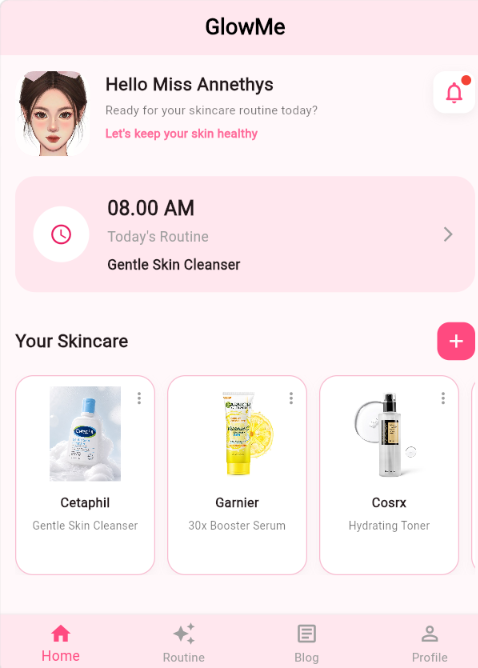
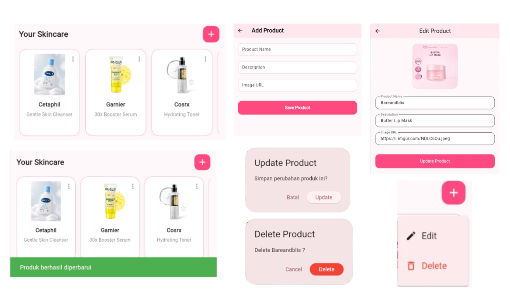
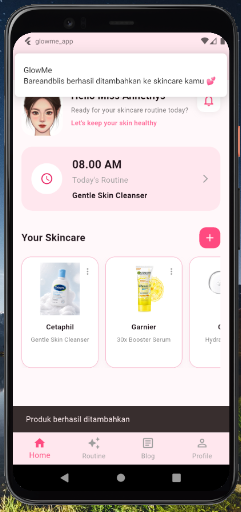

# 🌸 GlowMe App (Flutter)

<p align="center">
  
</p>

GlowMe adalah aplikasi mobile berbasis **Flutter** yang dirancang untuk membantu pengguna mengelola dan memantau rutinitas perawatan kulit secara lebih teratur dan personal. Aplikasi ini menyediakan fitur pencatatan skincare harian, manajemen produk skincare, rekomendasi produk, artikel edukasi, serta pengingat aktivitas skincare melalui notifikasi.

GlowMe juga dikembangkan menggunakan **Provider State Management**, **MockAPI**, **Asynchronous Programming**, dan **Local Storage** sehingga mampu menyimpan serta mengelola data pengguna secara dinamis.

---

# ✨ Features

## 🔐 Authentication

- Login
- Register
- Forgot Password
- Verification Code
- Change Password

📸 **Screenshot**


**Data User**
1. email: anee123@gmail.com
password: Anee123
2. email: emaa123@gmail.com
    password: Emaan123
3. email: agam123@gmail.com
    password: Agam123


**invalid login**


**Login Succesfull**


---

## 🏠 Home

Menampilkan ringkasan aktivitas skincare pengguna.

Fitur:

- Greeting User
- Notification Icon
- Today's Routine Widget
- Your Skincare Product
- Bottom Navigation

📸 Screenshot



---

## 🧴 Product Management (CRUD)

Pengguna dapat mengelola daftar skincare miliknya.

Fitur:

- Menampilkan daftar produk dari MockAPI
- Menambahkan produk
- Mengubah data produk
- Menghapus produk
- Scroll Horizontal Product List
- Popup Menu (Edit & Delete)

📸 Screenshot




---

## 🔔 Notification

GlowMe memberikan notifikasi ketika pengguna berhasil menambahkan produk skincare.

Fitur:

- Local Notification
- Android Notification
- Flutter Local Notifications

📸 Screenshot



---

## 💾 Local Storage

Menggunakan SharedPreferences untuk menyimpan data lokal seperti:

- Login Session
- User Preferences
- Routine Status (akan dikembangkan)

---

## ⚡ Asynchronous Programming

Seluruh komunikasi dengan MockAPI menggunakan asynchronous programming.

Contoh implementasi:

- Fetch Product
- Add Product
- Update Product
- Delete Product
- Login User
- Register User

---

## 📅 Routine (Coming Soon)

## 📰 Blog (Coming Soon)

## 👤 Profile (Coming Soon)

---

# 🏗️ Architecture

Project menggunakan arsitektur sederhana berbasis Provider.

```
lib
│
├── models
│   ├── routine_model.dart
│   └── user_model.dart
│
├── providers
│   ├── auth_provider.dart
│   ├── product_provider.dart
│   └── routine_provider.dart
│
├── services
│   ├── api_service.dart
│   ├── notification_service.dart
│   └── storage_service.dart
│
├── widgets
│   ├── home_header.dart
│   ├── mission_widget.dart
│   ├── product_card.dart
│   ├── routine_widget.dart
│   └── summary_card.dart
│
├── change_password_page.dart
├── code_confirmation_page.dart
├── edit_product.dart
├── forgot_password_page.dart
├── home_page.dart
├── login_page.dart
├── main.dart
├── signup_page.dart
```

---

# 📡 API

Menggunakan MockAPI sebagai backend sederhana.

### User API

```
https://6a508976c576c846dcb9840b.mockapi.io/users
```

### Product API

```
https://6a51d03ac576c846dcba8a68.mockapi.io/products
```

---

# 🛠 Tech Stack

- Flutter
- Dart
- Provider
- HTTP
- MockAPI
- Shared Preferences
- Flutter Local Notifications
- Material Design

---

# 📦 Dependencies

Tambahkan pada `pubspec.yaml`

```yaml
dependencies:
  flutter:
    sdk: flutter

  cupertino_icons: ^1.0.8
  font_awesome_flutter: ^11.0.0
  url_launcher: ^6.3.0
  http: ^1.6.0
  provider:  ^6.0.5
  shared_preferences: ^2.5.5
  flutter_local_notifications: ^19.4.0
```

---

# 🎨 Design System

| Item | Color |
|------|--------|
| Primary | #FFE7EE |
| Secondary | #E9F6FF |
| Accent | #FF4A80 |
| Success | #31C36C |

Style:

- Soft UI
- Minimalist
- Clean Design
- Rounded Corner
- Pastel Theme

---

# 🎨 Figma

https://www.figma.com/design/S6P5loJkfQsaoVM7DlvUkt/Glowmee

---

# 🔄 Application Flow

```
Login
   │
   ▼
Home
   │
   ├── Add Product
   │        │
   │        ▼
   │    MockAPI
   │        │
   ▼        ▼
Product List
   │
   ├── Edit Product
   ├── Delete Product
   └── Notification
```

---

# 🚀 How to Run

### 1 Clone Repository

```bash
git clone https://github.com/username glowme_app
```

### 2 Masuk Folder

```bash
cd glowme_app
```

### 3 Install Dependency

```bash
flutter pub get
```

### 4 Jalankan

```bash
flutter run
```

---

# 👨‍💻 Developed With

- Flutter
- Dart
- Provider State Management
- REST API (MockAPI)
- Asynchronous Programming
- Local Storage
- Local Notification

---

# 📌 Current Progress

✅ Authentication

✅ Home Page

✅ Product CRUD

✅ Provider

✅ MockAPI Integration

✅ Local Storage

✅ Local Notification

✅ Async Programming

⬜ Routine

⬜ Blog

⬜ Profile

⬜ Machine Learning Recommendation

---
# (✿◠‿◠) Author

Nama: Andini Prihartiningtias
Nim: 24120510003
Project: Flutter Glowme
Purpose: UTS Mobile Computing

---

# 🌸 GlowMe

*"Healthy Skin Starts with Consistent Care."*

